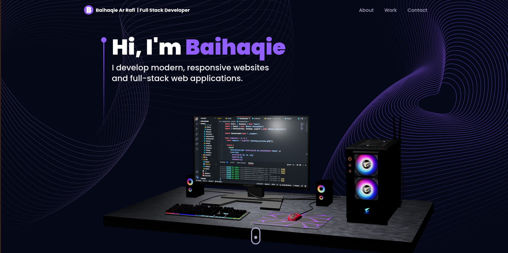

# 👋 Hi, I'm Baihaqie Ar Rafi

<p align="center">
  
</p>

<h3 align="center">
  Full-Stack Developer · Web Developer · Informatics Management Student
</h3>

<p align="center">
  <a href="https://github.com/bangpii">
    
  </a>
  <a href="https://www.linkedin.com/in/baihaqie-arrafi-26311b2a8/">
    
  </a>
</p>

<p align="center">
  
</p>

---

## 🧑‍💻 About Me

I'm **Baihaqie Ar Rafi**, an Informatics Management student at **Politeknik Negeri Medan** who is passionate about building modern, scalable, and user-focused applications.

I enjoy working across the stack — from designing responsive interfaces and developing APIs to managing databases, configuring servers, and deploying applications.

```javascript
const baihaqie = {
  role: "Full-Stack Developer",
  education: "Informatics Management",
  university: "Politeknik Negeri Medan",

  interests: [
    "Web Development",
    "Frontend Development",
    "Backend Development",
    "Mobile Development",
    "Database Engineering",
    "Server & Deployment"
  ],

  currentlyLearning: [
    "Advanced React",
    "Next.js",
    "TypeScript",
    "Backend Architecture",
    "System Design"
  ],

  mindset: "Build → Break → Learn → Improve"
};
```

---

# ⚡ Tech Stack

## 🌐 Frontend Development

<p>
  
</p>

**HTML · CSS · JavaScript · TypeScript · React · Next.js · Vite · Tailwind CSS**

---

## ⚙️ Backend Development

<p>
  
</p>

**Node.js · Express.js · PHP · Laravel · CodeIgniter · REST API**

---

## 🗄️ Database

<p>
  
</p>

**MongoDB · MySQL · MariaDB · PostgreSQL · Oracle Database**

---

## 📱 Mobile Development

<p>
  
</p>

**Flutter · Dart · Android Development · Java**

---

## 🛠️ Tools & Development Environment

<p>
  
</p>

**Git · GitHub · Linux · VS Code · XAMPP**

---

## 🌐 Server & Infrastructure

<p>
  
</p>

**Nginx · Apache · Cloudflare · Firebase · ngrok**

### Server & Deployment

```text
🐧 Linux
🌐 Nginx
🪶 Apache
🔥 Firebase
☁️ Cloudflare
🔗 ngrok
📦 XAMPP
```

---

# 🚀 What I Can Build

```text
┌──────────────────────────────────────────────┐
│                 DEVELOPMENT                 │
├──────────────────────────────────────────────┤
│                                              │
│  🌐 Responsive Web Applications              │
│  ⚛️ React / Next.js Applications             │
│  🔷 TypeScript Applications                  │
│  🔌 REST API & Backend Services              │
│  🗄️ Database-driven Applications             │
│  📱 Flutter Mobile Applications              │
│  🔐 Authentication & Authorization           │
│  ⚡ Real-time Applications                   │
│  🎨 Modern UI / UX                           │
│  🖥️ Server Configuration                      │
│  🌐 Nginx / Apache Configuration              │
│  ☁️ Cloud & Deployment                       │
│                                              │
└──────────────────────────────────────────────┘
```

---

# 🏆 Featured Projects

## 🥇 MI TECNO DESIGN — Company Website

A modern company website developed for a web development competition.

### Stack

```text
React.js
Three.js
Node.js
Express.js
Socket.io
MongoDB
REST API
Realtime CMS
Admin Dashboard
```

🏆 **1st Place — MI TECNO DESIGN Website Company**

---

## 👻 Cerita Horor Nusantara

An editorial-style digital archive dedicated to Indonesian horror stories and folklore.

Designed around a dark, immersive interface with modern interactions and motion.

### Stack

```text
React
TypeScript
Tailwind CSS
Framer Motion
```

---

## 💄 GlowHue

An AI-inspired beauty platform concept focused on personalized makeup experiences and modern UI/UX.

### Stack

```text
React
Vite
Tailwind CSS
JavaScript
```

---

## 🛍️ Raharpa Thrift

A modern thrift shopping platform focused on clean interfaces, responsive layouts, and an enjoyable browsing experience.

### Stack

```text
React
Vite
Tailwind CSS
```

---

## ⚛️ BangPiiReact

A developer-tool concept designed to simplify React project scaffolding and provide developers with a faster starting point.

### Stack

```text
React
Vite
TypeScript
Node.js
```

---

# 📊 GitHub Statistics

<p align="center">
  


</p>

<p align="center">
  
</p>

---

# 🧠 Development Journey

```text
2022
 │
 ├── Started Programming
 │   ├── Turbo Pascal
 │   └── C++
 │
 ▼
2023
 │
 ├── Java
 ├── Android Development
 └── Database Fundamentals
 │
 ▼
2024
 │
 ├── PHP
 ├── Laravel
 ├── MySQL / MariaDB
 └── Web Development
 │
 ▼
2025
 │
 ├── React
 ├── Node.js
 ├── Express.js
 ├── MongoDB
 ├── Flutter
 └── REST API
 │
 ▼
2026
 │
 ├── TypeScript
 ├── Next.js
 ├── Backend Architecture
 ├── Nginx
 ├── Apache
 ├── Cloud & Deployment
 └── Full-Stack Development
```

---

# 🎯 Currently Learning

<p align="center">

`React` · `Next.js` · `TypeScript` · `Node.js` · `System Design`

</p>

I'm continuously improving my understanding of:

* ⚛️ Advanced React patterns
* 🔷 TypeScript
* 🚀 Next.js
* 🏗️ Backend architecture
* 🔌 REST API design
* 🗄️ Database architecture
* 🌐 Nginx & Apache
* ☁️ Cloud & deployment
* 🔐 Authentication & security
* 📐 System design

---

# 💼 Open to Opportunities

I'm interested in opportunities related to:

```text
Frontend Developer
Full-Stack Developer
Backend Developer
Web Developer
Software Developer
Internship
Freelance / Collaboration
```

I'm always open to learning from experienced developers, contributing to interesting projects, and collaborating with people who enjoy building technology.

---

# 🧰 Development Environment

```text
Operating System
├── Linux
└── Windows

Frontend
├── React
├── Next.js
├── Vite
├── TypeScript
└── Tailwind CSS

Backend
├── Node.js
├── Express.js
├── PHP
├── Laravel
└── CodeIgniter

Database
├── MongoDB
├── MySQL
├── MariaDB
├── PostgreSQL
└── Oracle

Mobile
├── Flutter
├── Dart
└── Android

Server
├── Nginx
├── Apache
├── XAMPP
├── Cloudflare
└── ngrok

Version Control
├── Git
└── GitHub
```

---

# 📫 Connect With Me

<p align="center">

<a href="https://github.com/bangpii">
  
</a>

<a href="https://www.linkedin.com/in/baihaqie-arrafi-26311b2a8/">
  
</a>

</p>

---

<p align="center">

### 💻 Code is not just about making things work.

### It's about making them better.

<br/>

⭐ **If you find my projects interesting, consider giving them a star!**

<br/>

<sub>© 2026 Baihaqie Ar Rafi · Built with curiosity, coffee, and code.</sub>

</p>
